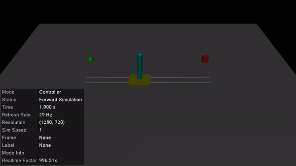

# mujoco_sim.jl
Julia package for MuJoCo physics simulation and visualization. This package is a more easy-to-use (at least for me) adaptation of the awesome [LyceumMuJoCo.jl and LyceumMuJoCoViz.jl packages](https://docs.lyceum.ml/dev/).

## Installation
1. Open your Julia REPL by typing  `julia` in your terminal.
2. Press `]` on your keyboard to enter the package manager
3. Enter command `add https://github.com/adubredu/mujoco_sim.jl` and press 
`Enter` on your keyboard to install this package.
4. Press the `Backspace` key on your keyboard to return to the REPL

## Usage
Example scripts can be found in the [examples](examples) folder in this repo. 

The [balance_cartpole.jl](examples/balance_cartpole.jl) script shows how to use
`mujoco_sim` to balance a cartpole using an LQR feedback controller. 

Once you run this script, you should see the cartpole try to balance the 
pole vertically as shown in the gif below:

